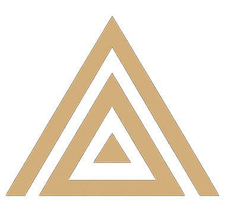

# Veyra Discord Client BETA

**Enhanced Discord Experience**

A fork of [BetterDiscord](https://github.com/BetterDiscord/BetterDiscord) with a gold & navy visual identity and exclusive features for power users.

<p align="center">
  
</p>

---

## What is Veyra?

Veyra is a client modification for Discord that lets you customize your experience with plugins, themes, custom CSS, and more. Built on the foundation of BetterDiscord, Veyra adds several unique features while maintaining full BetterDiscord plugin compatibility.

## Features

### Core (inherited from BetterDiscord)
- **Plugin System** — Load, enable, disable, and manage JavaScript plugins
- **Theme System** — Apply custom CSS themes to completely reskin Discord
- **Custom CSS Editor** — Built-in live CSS editor with syntax support and auto-apply
- **Webpack Module Access** — Search and use Discord's internal modules
- **Monkey Patching** — Before/after/instead patching for Discord functions
- **Settings Panel** — Full settings UI injected into Discord's settings sidebar
- **Data Persistence** — Persistent storage for plugins, themes, and settings
- **BdApi Compatibility** — BetterDiscord plugins work out of the box via the `BdApi` compatibility layer

### Veyra-Exclusive Features

| Feature | Description |
|---------|-------------|
| **Command Palette** | Press `Ctrl+Shift+P` to open a Spotlight-style command palette. Quickly find any setting, toggle plugins/themes, and run tools — all from the keyboard. |
| **Snippet Manager** | One-click CSS snippet library. 12+ pre-built tweaks (hide gift button, compact mode, gold links, enhanced code blocks, etc.) with instant toggles — no theme editing required. |
| **Theme Profiles** | Automatically switch themes when you navigate to different servers or channels. Set a per-server or per-channel theme profile and Veyra handles the rest. |
| **Performance Monitor** | Real-time FPS counter, memory usage graph, DOM node count, and uptime overlay. Draggable, always-on-top widget for diagnosing performance issues. |
| **Veyra Color Scheme** | Default gold (#C4A265) accents with dark greyscale backgrounds, inspired by [veyras.dev](https://veyras.dev). |

---

## Installation

### Prerequisites
- [Node.js](https://nodejs.org/) 16+
- Discord desktop app installed and run at least once

### Quick Install
```bash
# Clone the repository
git clone https://github.com/diwany/veyra-dc.git
cd veyra-dc

# Install dependencies
npm install

# Build and inject in one step
npm run install-veyra
```

### Manual Install
```bash
# Build the bundle
npm run build

# Inject into Discord
npm run inject

# Restart Discord
```

### Uninstall
```bash
npm run uninject
# Then restart Discord
```

---

## Usage

### Quick Actions (Ctrl+Shift+P)
Press `Ctrl+Shift+P` anywhere in Discord to open the command palette. Type to search through all available commands:
- Toggle plugins/themes
- Open settings panels
- Clear cache
- Toggle DevTools
- Toggle Performance Monitor
- And more

### Settings
Open Discord Settings → scroll down to the **Veyra** section in the sidebar. From there you can access:
- **Settings** — General, appearance, and developer options
- **Plugins** — Manage installed plugins
- **Themes** — Manage themes and the built-in Veyra Dark theme
- **Snippets** — Toggle pre-built CSS snippets
- **Theme Profiles** — Assign themes to servers/channels
- **Custom CSS** — Write and live-preview your own CSS

### Writing Plugins
Veyra plugins use the same format as BetterDiscord. A basic plugin:

```javascript
module.exports = class MyPlugin {
    constructor() {
        this.name = "My Plugin";
        this.description = "Does something cool";
        this.version = "1.0.0";
        this.author = "You";
    }

    start() {
        console.log("Plugin started!");
        BdApi.injectCSS("my-plugin", "body { background: red; }");
    }

    stop() {
        BdApi.clearCSS("my-plugin");
    }

    getSettingsPanel() {
        const el = document.createElement("div");
        el.textContent = "Settings go here";
        return el;
    }
};
```

Both `BdApi` and `VeyraAPI` are available globally.

### Writing Themes
Themes are standard CSS files with optional metadata:

```css
/**
 * @name My Theme
 * @description A custom theme
 * @version 1.0.0
 * @author You
 */

.theme-dark {
    --background-primary: #1a1a2e;
    --background-secondary: #16213e;
    --brand-experiment: #c4a265;
}
```

---

## Project Structure

```
Veyra/
├── src/
│   ├── core/           # Entry point and configuration
│   │   ├── index.js    # Main bootstrap
│   │   └── config.js   # Version, paths, defaults, colors
│   ├── modules/        # Core systems
│   │   ├── webpackmodules.js    # Webpack module finder
│   │   ├── patcher.js           # Monkey-patching
│   │   ├── pluginmanager.js     # Plugin lifecycle
│   │   ├── thememanager.js      # Theme lifecycle
│   │   ├── customcss.js         # Live CSS editor
│   │   ├── settingsmanager.js   # Settings persistence
│   │   ├── datastore.js         # localStorage wrapper
│   │   ├── dommanager.js        # Safe DOM manipulation
│   │   ├── snippetmanager.js    # ★ One-click CSS snippets
│   │   ├── themeprofiles.js     # ★ Per-server theme switching
│   │   └── performancemonitor.js# ★ FPS/memory overlay
│   ├── ui/             # User interface
│   │   ├── uimanager.js         # UI injection & modal
│   │   ├── quickactions.js      # ★ Command palette
│   │   └── panels/
│   │       └── settingspanel.js # Settings panel renderer
│   ├── api/            # Public plugin API
│   │   └── index.js    # VeyraAPI + BdApi compat layer
│   ├── styles/         # CSS
│   │   └── veyra.css   # Core styles (gold & navy)
│   └── utils/          # Shared utilities
│       ├── logger.js
│       └── utils.js
├── installer/          # Discord injection scripts
│   ├── inject.js
│   ├── uninject.js
│   └── install.js
├── webpack.config.js
├── package.json
└── README.md
```

Items marked with ★ are Veyra-exclusive features.

---

## Attribution

Veyra is a fork of [BetterDiscord](https://github.com/BetterDiscord/BetterDiscord) by the BetterDiscord team. The core architecture — webpack module finding, monkey-patching, plugin/theme management, and DOM injection — is based on BetterDiscord's design.

Veyra extends this foundation with its own features (Command Palette, Snippet Manager, Theme Profiles, Performance Monitor) and visual identity (gold & navy color scheme from [veyras.dev](https://veyras.dev)).

## License

MIT — see [LICENSE](LICENSE) for details.

---

<p align="center">
  <strong>Veyra</strong> — Enhanced Discord Experience<br/>
  <a href="https://veyras.dev">veyras.dev</a>
</p>
